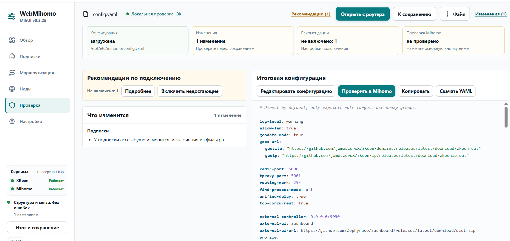

# Иерархия действий после редактирования

## Шаг 1 — конфигурация изменена

Состояние: требует исправления иерархии действий.

- Пользовательская цель: проверить и применить сделанное визуальными редакторами изменение.
- Сильная сторона: верхняя панель уже показывает, что есть изменение, и содержит действие «К сохранению».
- Основной риск: «Открыть с роутера» визуально доминирует, хотя конфигурация загружается автоматически и это действие редко нужно.
- Вторичный риск: кнопка «Проверить в Mihomo» рядом с YAML воспринимается как действие над кодом, а не как общий шаг сохранения изменений.
- Рекомендация: сделать верхнюю кнопку единым основным действием «Проверить и сохранить», показывать её акцентной заливкой только при наличии изменений. После нажатия выполнить проверку; при успехе сразу сохранить и применить, при ошибке перейти в раздел «Проверка» и сфокусировать сообщение.
- Рекомендация: перенести «Открыть с роутера» в меню «Файл» и переименовать в «Перезагрузить с роутера», чтобы явно обозначить замену текущих несохранённых изменений.
- Рекомендация: оставить кнопку у YAML вторичной и назвать «Проверить YAML в Mihomo»; она нужна для ручного редактирования и повторной диагностики.
- Доступность: не использовать постоянное мерцание. Состояние основного действия должно передаваться текстом, цветом и видимым focus-state; для фоновой проверки нужен `aria-live`.
- Ограничение: по одному скриншоту нельзя проверить клавиатурный фокус, поведение меню и переход к ошибке.
