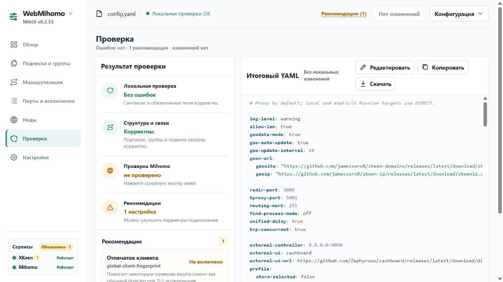
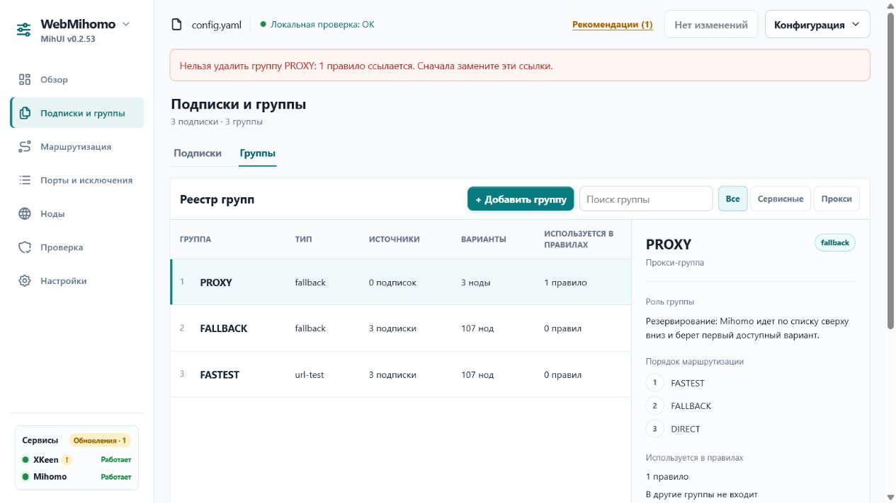
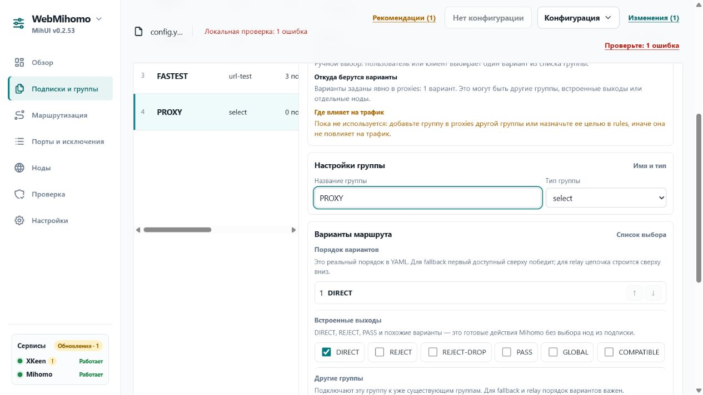
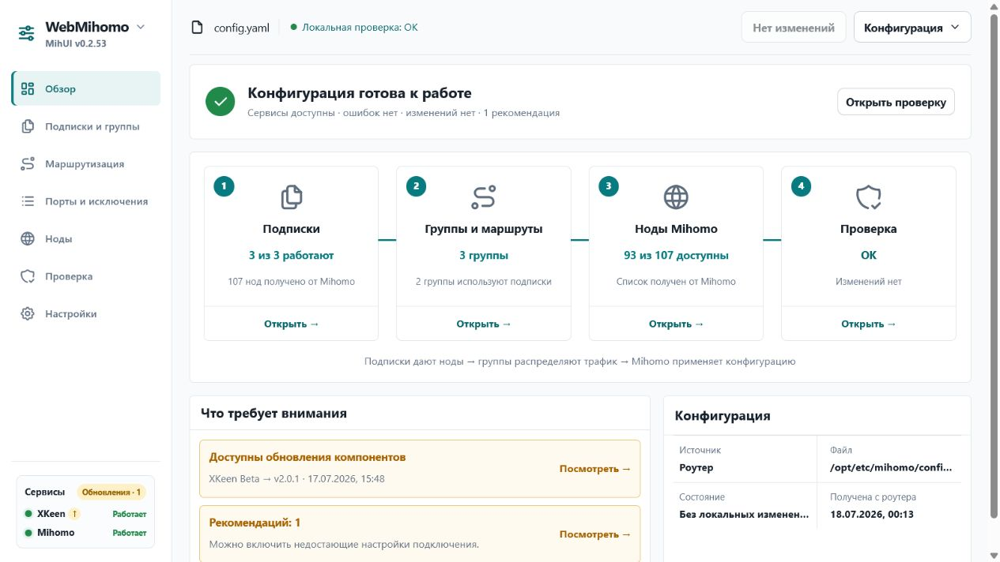
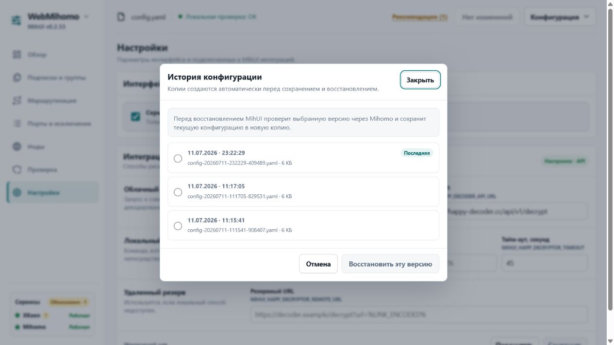
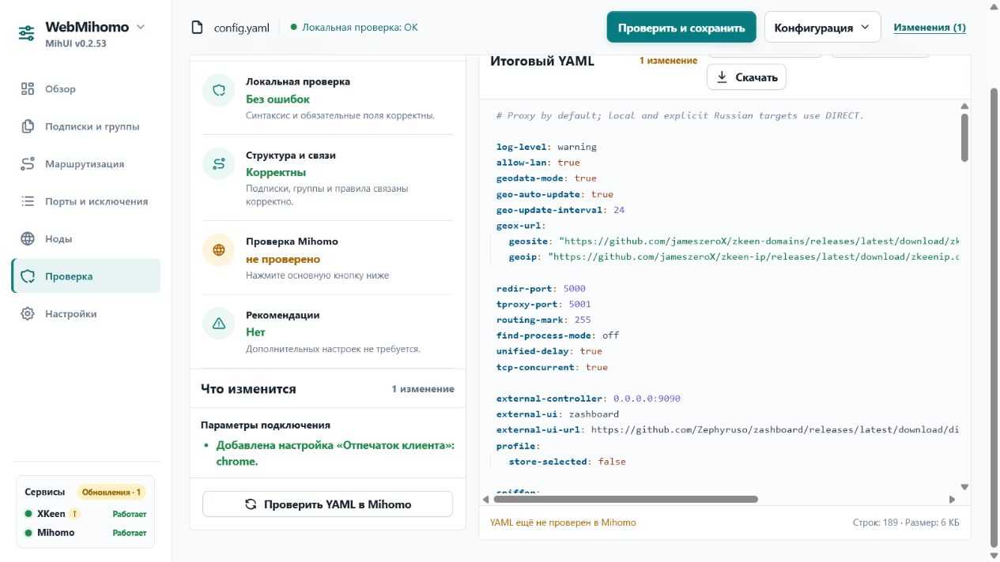
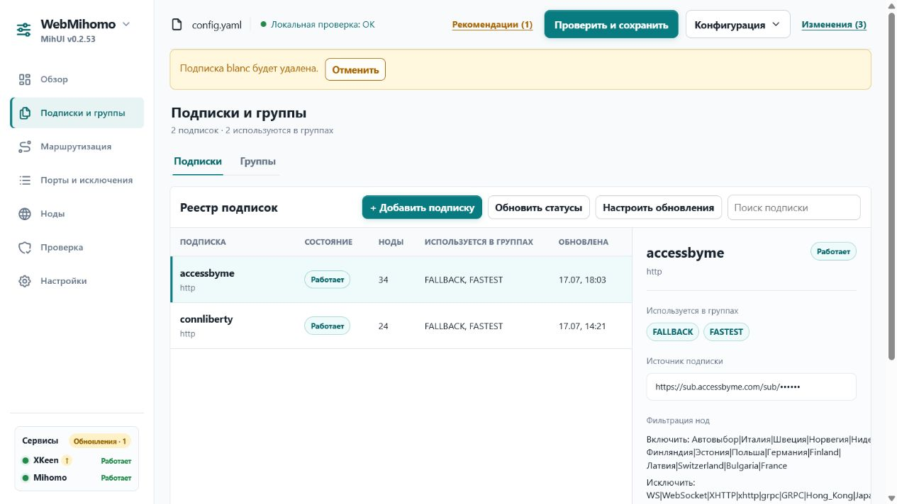

# Аудит защиты от пользовательских ошибок

Дата: 18.07.2026  
Поверхность: работающий MihUI v0.2.53 на роутере  
Сценарии: проверка конфига, редактирование групп, удаление зависимостей, сохранение, восстановление и потеря черновика.

## Итог

Защита есть и хорошо предотвращает запись технически некорректного YAML. Она слабее защищает от логически корректных, но нежелательных изменений, потери несохранённого черновика и перезаписи более свежей версии конфига.

## Проверенные шаги

1. **Обзор состояния — хорошо.** Интерфейс показывает работоспособность сервисов, подписок, групп, нод и локальной проверки до редактирования.

   

2. **Экран проверки — хорошо.** Локальная структура, связи, результат Mihomo и рекомендации разделены; проверка ядром вынесена в отдельный явный статус.

   

3. **Удаление используемой группы — хорошо.** Операция блокируется, перечисляется зависимость и предлагается сначала заменить ссылку.

   

4. **Некорректное редактирование — хорошо, но ошибка удалена от поля.** Дублирование имени делает конфиг недоступным для сохранения. При этом поле не получает видимой inline-ошибки или `aria-invalid`; причина находится в верхней части экрана.

   

5. **Перезагрузка с черновиком — плохо.** После изменения страницы обычная перезагрузка проходит без предупреждения, а локальные изменения исчезают.

   

6. **Восстановление резервной копии — хорошо.** Нужен явный выбор версии; кнопка восстановления до выбора отключена. Текст сообщает о проверке версии и создании новой копии текущего файла.

   

7. **Сохранение корректного изменения — требует усиления.** Diff доступен и понятен, но кнопка «Проверить и сохранить» сразу запускает проверку и применение; обязательного подтверждения высокорисковых изменений нет.

   

8. **Удаление подписки — частично защищено.** Подписка и её связи удаляются без подтверждения. Есть действие «Отменить», но хранится только одна последняя отмена; следующее удаление заменит предыдущую точку возврата.

   

## Что уже защищено

- Блокирующая локальная проверка: обязательные разделы и поля, дубли имён, отсутствующие цели правил и provider-ссылки.
- Предупреждения: пустые группы, неиспользуемые подписки, повторяющиеся URL, неподходящие схемы ссылок.
- Проверка итогового YAML самим Mihomo перед записью.
- Атомарная запись, автоматическая резервная копия, подтверждение применения и rollback при подтверждённом отказе.
- Запрет удаления используемой группы; подтверждение удаления свободной группы; отмена удаления подписки, правила или группы.
- Явный выбор резервной версии и проверка backup перед восстановлением.
- Ссылки подписок скрыты по умолчанию, API-ключ не выводится открытым текстом.
- Опасные системные действия (обновление, переустановка, перезапуск, откат компонентов) требуют подтверждения.

## Главные пробелы

1. **Высокий риск — потеря черновика.** Нет `beforeunload`-защиты при перезагрузке, закрытии вкладки или переходе на другой адрес.
2. **Высокий риск — логически опасный, но валидный конфиг.** Можно корректно изменить основной маршрут на `DIRECT`, удалить подписки или переставить правила и применить результат без обязательного просмотра изменений. Mihomo подтвердит синтаксис, но не намерение пользователя.
3. **Высокий риск — конфликт версий.** Сохранение не передаёт хэш исходного конфига. Вторая вкладка или внешнее изменение могут быть молча перезаписаны старым состоянием.
4. **Средний риск — непоследовательное удаление.** Используемая группа защищена жёстко, но подписки и правила удаляются сразу; отмена только одноуровневая.
5. **Средний риск — восстановление без обратного rollback.** Backup проверяется до записи и текущая версия сохраняется, но при отказе перезагрузки восстановленный файл автоматически не откатывается.
6. **Средний риск — сообщения формы.** Блокирующая ошибка отображается глобально, но не связывается с конкретным полем для клавиатуры и скринридера.

## Приоритет исправлений

1. Предупреждать о несохранённых изменениях через `beforeunload`.
2. Для высокорисковых изменений требовать короткое подтверждение с резюме diff: удаление подписок/правил, изменение основной группы, появление `DIRECT`/`REJECT` в основном маршруте.
3. Добавить optimistic locking: сохранять только если хэш исходного конфига на роутере не изменился.
4. Унифицировать удаление и сделать историю отмены многошаговой либо подтверждать удаление связанных сущностей.
5. Откатывать восстановление backup при подтверждённой ошибке применения.

## Ограничения проверки

- Не выполнялось реальное сохранение тестовых изменений в конфиг роутера.
- Не проверялись скринридер, полный клавиатурный проход, мобильный reflow и контраст инструментальными средствами.
- Серверные выводы подтверждены чтением текущей реализации и тестов, но аварийные сценарии Mihomo не воспроизводились на работающем роутере.
