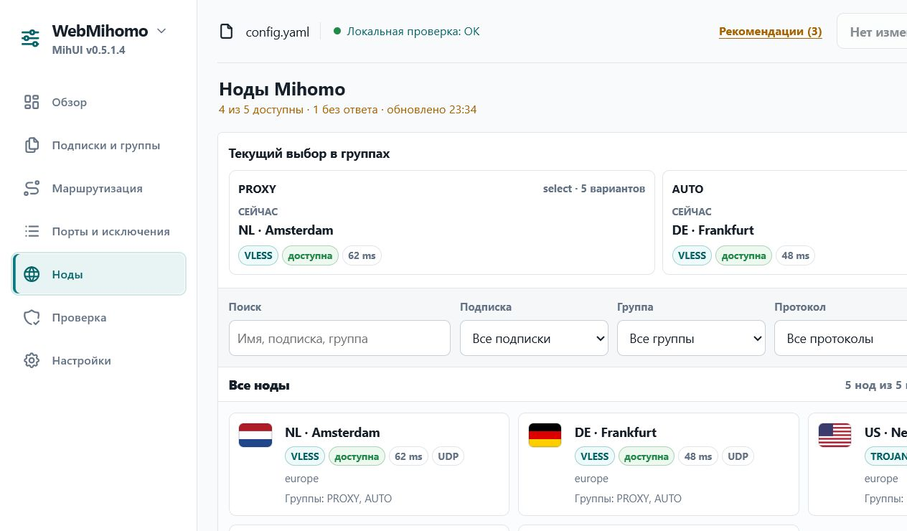

# Аудит необходимого недостающего функционала

Дата: 17.07.2026

## Область

Проверены текущий раздел «Ноды», маршруты локального API и сценарий «проверить → сохранить → применить». Сравнение выполнено с актуальными возможностями metacubexd и zashboard и с официальным API Mihomo.

## Вывод

После исключения уже реализованных функций (проверка YAML, применение, история и восстановление, импорт/экспорт, диагностика, поиск, статусы нод и подписок) осталось два существенных пробела.

### 1. Живое переключение выбора в группе — P0

Раздел «Ноды» показывает текущий выбор в каждой группе, но не позволяет его изменить. Для Mihomo это базовая операция управления трафиком; официальный API поддерживает `PUT /proxies/{group}` с телом `{"name":"..."}`, а metacubexd прямо относит управление proxy groups и тест задержки к основным функциям.

Минимальная реализация:

- только для групп типа `select`;
- действие «Сменить» в существующей карточке группы;
- список уже полученных `all` без нового экрана;
- backend-прокси к `PUT /proxies/{group}`;
- после успеха обновить `/api/nodes` и показать новый текущий выбор;
- явно подписать, что меняется активный выбор Mihomo, а не YAML.

Тест задержки группы или ноды полезен, но это второй этап той же функции, не отдельный обязательный раздел.

### 2. Проверяемое применение с возвратом предыдущей версии — P0 для надежности

Сейчас файл записывается до reload. Если reload возвращает ошибку, новая версия остается на диске, UI считает ее сохраненной и предлагает ручное восстановление из истории. Это создает расхождение: на диске одна конфигурация, в работающем Mihomo может оставаться другая.

Минимальная реализация:

- после `PUT /configs?force=true` проверить, что Mihomo отвечает и использует ожидаемый путь;
- только после этой проверки считать версию примененной;
- при подтвержденной неудаче восстановить только что созданный backup и повторить reload;
- вернуть в UI раздельный итог: «применено», «не применено, предыдущая версия восстановлена» или «состояние не удалось подтвердить».

## Шаги проверки

1. «Ноды»: состояние хорошее для наблюдения, но критически неполное для управления — текущий выбор виден, изменить его нельзя.
2. «Проверка и сохранение»: проверка до записи есть; после записи отсутствует подтверждение фактического применения и автоматический возврат.

## Доказательство

## Источники сравнения

- https://github.com/MetaCubeX/metacubexd
- https://github.com/Zephyruso/zashboard
- https://wiki.metacubex.one/ru/api/

## Ограничения

Скриншот подтверждает состав и affordance текущего раздела, но не полную доступность с клавиатуры и не поведение на реальном роутере. Вывод о сохранении основан на чтении текущего frontend/backend-кода; разрушительные проверки reload на живом роутере не выполнялись.
