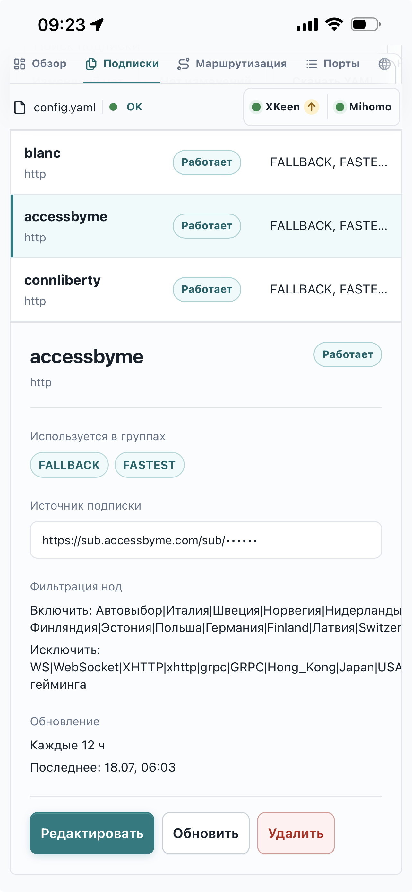

# Аудит отображения фильтров подписки на мобильном

## Экран 1 — карточка выбранной подписки

Состояние: требует улучшения.

Сильные стороны:

- фильтры находятся в логичном месте между источником и обновлением;
- включение и исключение различимы по текстовым меткам;
- основные действия подписки остаются заметными.

Проблемы:

- необработанные регулярные выражения занимают слишком много высоты и становятся главным визуальным элементом карточки;
- длинные значения переносятся в случайных местах и плохо сканируются;
- подпись и значение почти не разделены визуально;
- полное содержимое показывается всегда, хотя обычно достаточно знать, что оба правила настроены.

## Рекомендуемое решение

Сделать «Фильтрацию нод» сворачиваемой строкой по существующему паттерну `details/summary`:

- в закрытом состоянии: `Фильтрация нод · 2 правила` и стрелка раскрытия;
- в открытом состоянии: две компактные строки «Включать» и «Исключать»;
- значение каждой строки показывать моноширинным текстом максимум в две строки с отдельным раскрытием полного значения;
- не разбивать регулярное выражение на чипы: символ `|` может быть частью более сложного выражения, поэтому такое представление способно исказить смысл.

На мобильном секция должна быть закрыта по умолчанию. Область заголовка — не меньше 44 px, состояние раскрытия должно передаваться не только стрелкой, но и семантикой `details/summary`.

## Ограничения проверки

Аудит основан на одном статичном мобильном скриншоте. Поведение прокрутки, фокуса, клавиатуры и экранного диктора не проверялось.
